<h1>用户手册</h1>

- 登录注册
- 发布任务
- 接收任务
- 举报任务

<h2>注册登录</h2>

简介明了的UI设计，如果有账户了，则直接填写用户名和密码进行登录（此时登录过成功后直接跳转至主界面），没有账户的用户就点击最下方的 *还没有账号？请注册* 进行注册。根据提示进行填写，明确标出的必填项则必须填写，否则可能会造成注册不成功。 

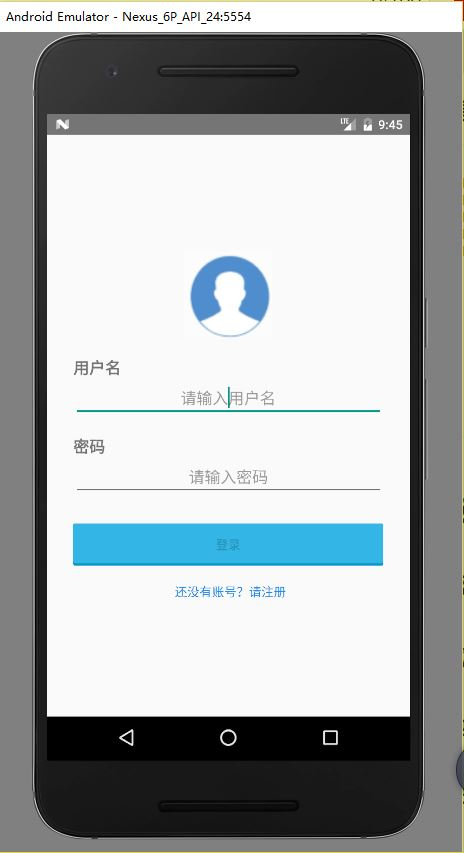 
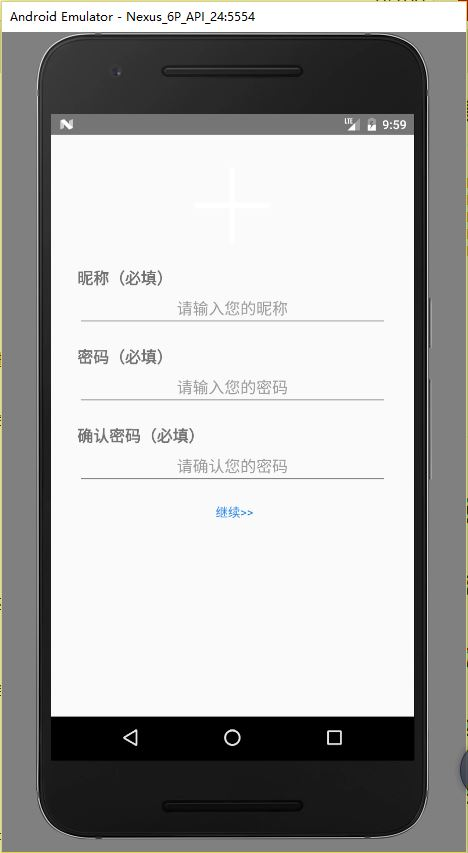 
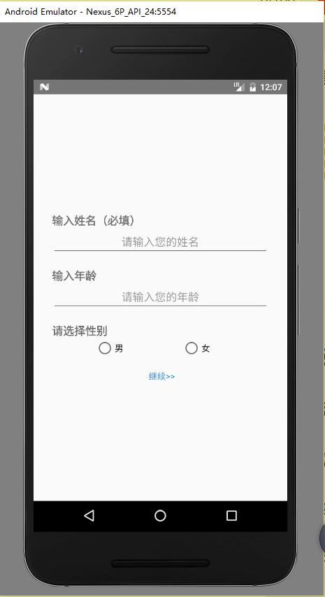 
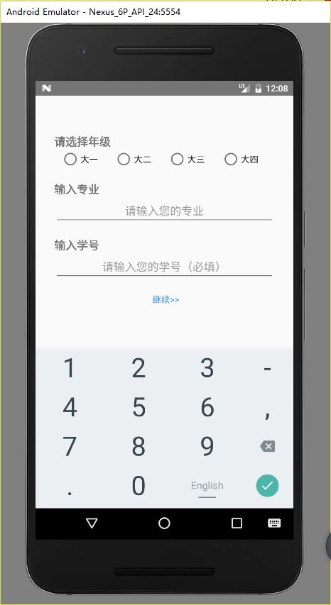 
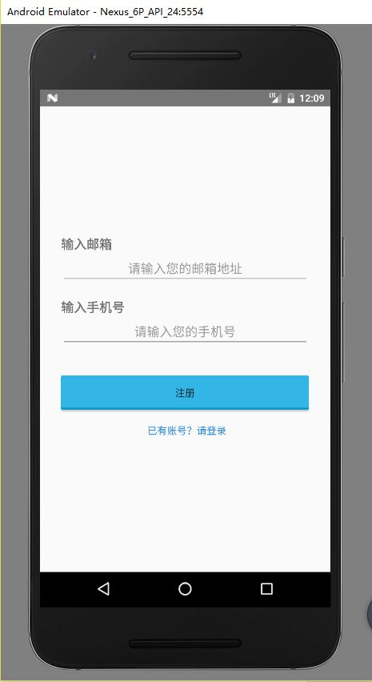 

<h2>主界面</h2>
主任务界面包括三大主体，首页、任务和我的三页，用户可根据自己的需求进行选择页面,然后进行相应的操作 

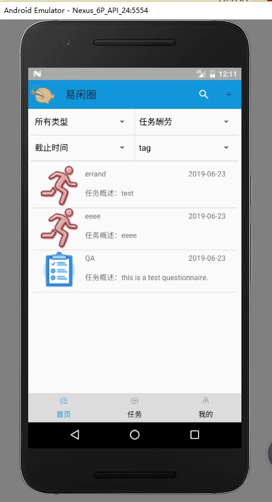 
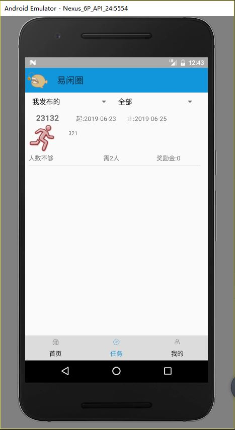 
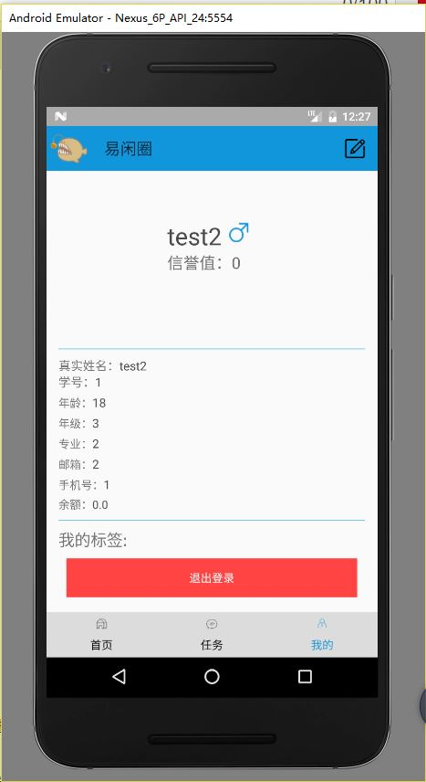 

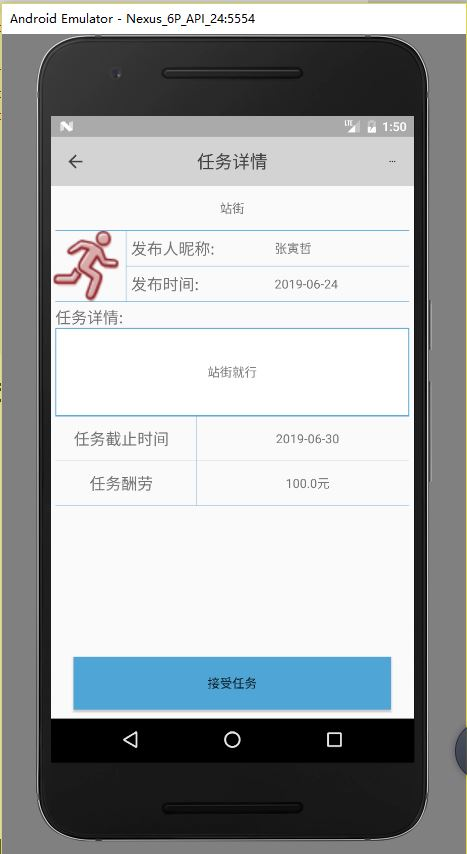 
任务详情界面 

用户想创建任务时，就在首页的右上角点击+号，然后进行选择创建什么任务。 
如图所示：
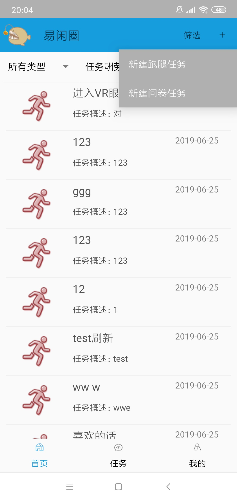 
然后根据自己的需求进行选择任务类型。 
若是跑腿任务：
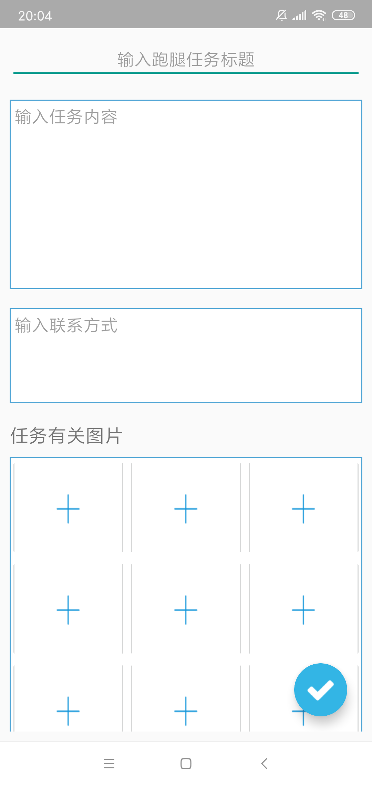 
新建跑腿任务界面 
若是新建问卷任务：则会依次遇到如下页面：在输入金额和人数后会遇到标签页，此时的标签页不止一个，在此为了简化所以没有全部展示。最后创建完成后会有一个提示信息，并跳转至首页。
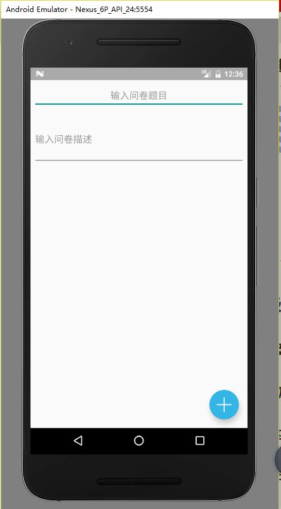 
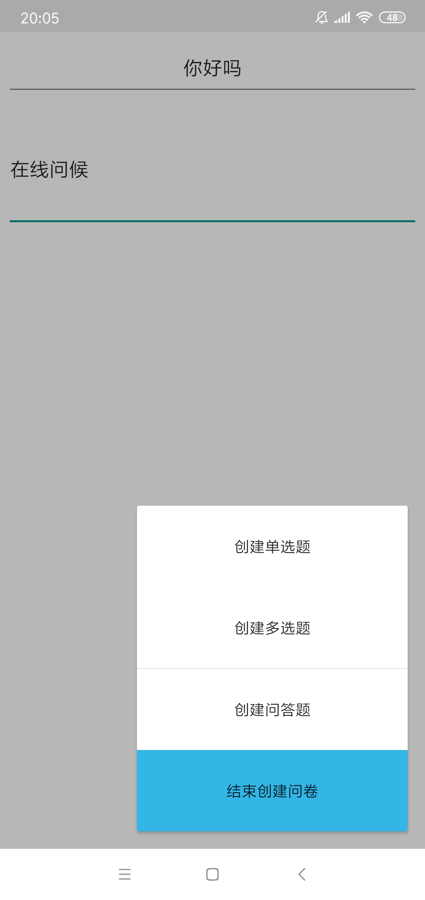 
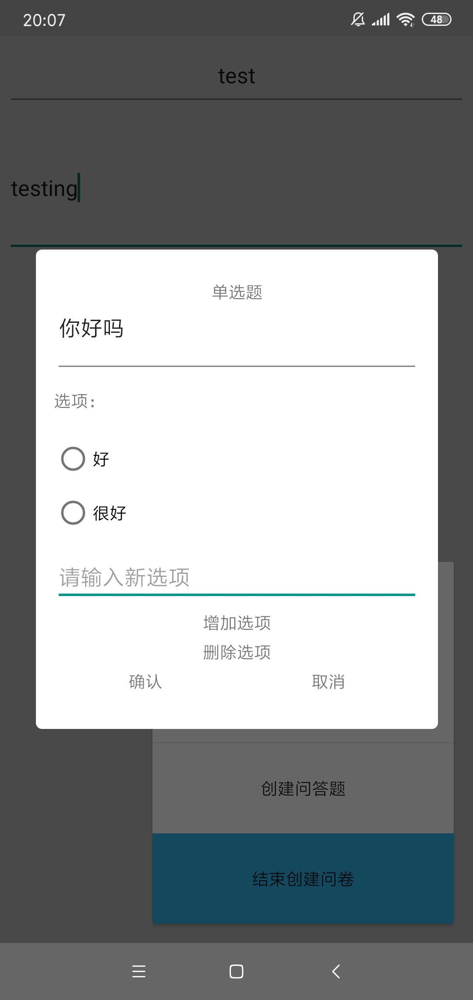 
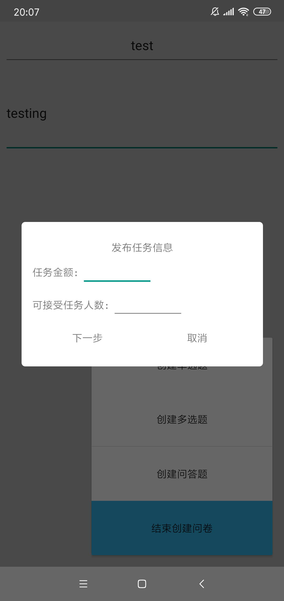 
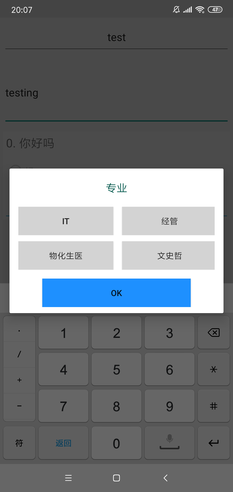 
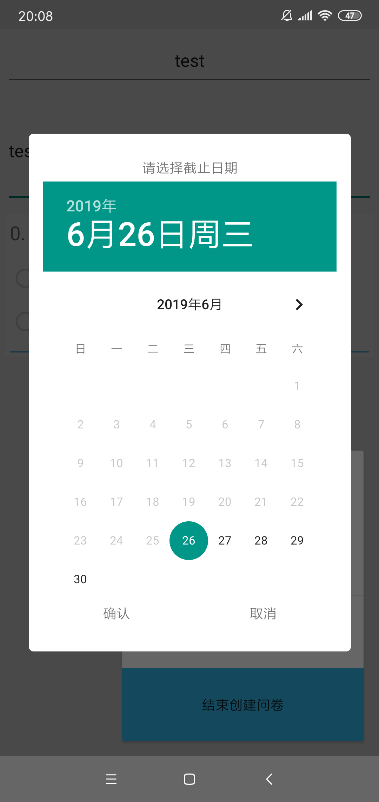 

<h2>接收任务</h2>
用户登录自己的账号，然后在首页中查看任务，可以选择其中的任务进行接收，点击接收任务后，会弹出成功接收的信息，并退回到首页。 

 

<h2>举报任务</h2>
若用户觉得某项任务不真实，存在明显的欺诈行为，那么我们就可以对其进行举报,举报过程大致如下：
先进入要举报的任务，然后点击右上角的省略号，在扩展出来菜单中选择举报，然后填写举报理由;举报成功后会弹出一条提示信息，并退回到首页。

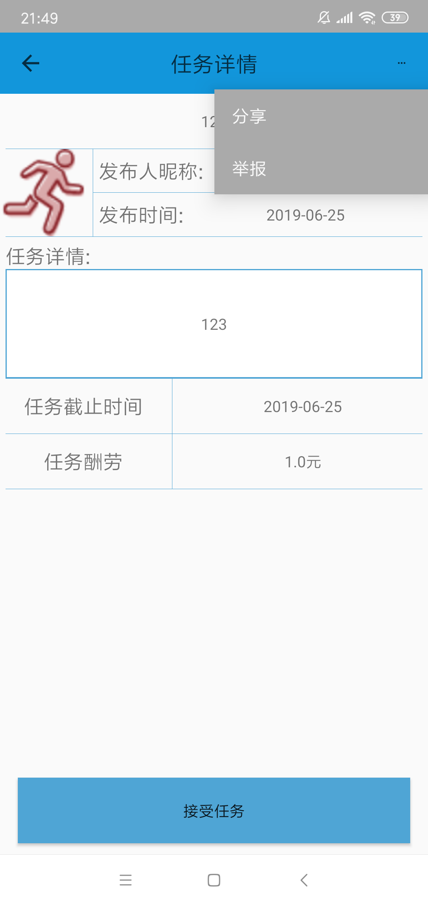 
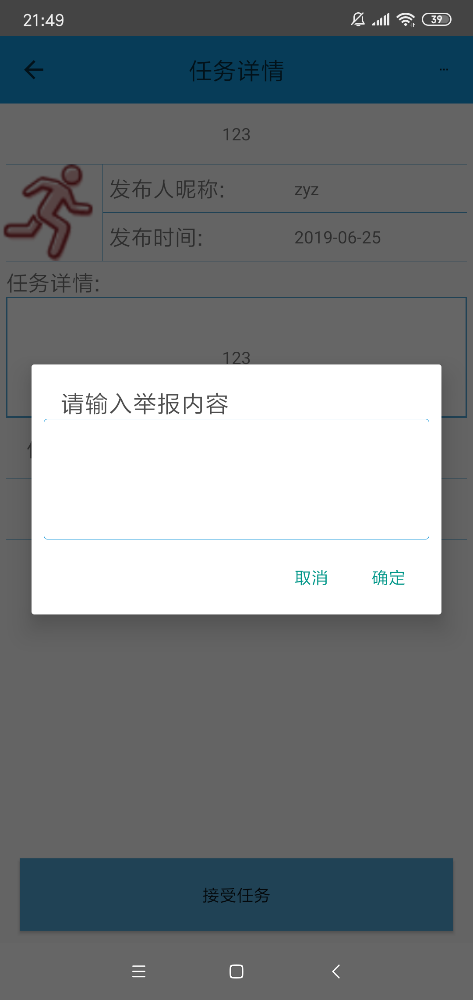 