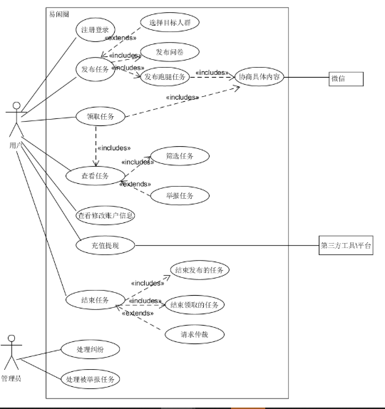

<h1>软件需求规格说明书</h1>

<h2>1.引言</h2>
<h3>1.1 编写目的</h3>
&emsp;&emsp;为了保证项目团队按时完成项目目标，便于项目团队成员更好地了解项目情况，使项目工作开展的各个过程合理有序，也便于用户与开发成员进行沟通交流，因此将以文档形式描述项目的各项功能需求、性能需求，阐述项目背景及范围等总体结构和功能结构。此文档也是后续软件开发的依据。
<h3>1.2 背景</h3>
&emsp;&emsp;在完成了针对图片大学生闲时时间活动的前期调查，同时与多位大学生进行了全面深入地探讨和分析的基础上，提出了这份软件需求规格说明书。 
&emsp;&emsp;此需求规格说明书对易闲圈APP系统软件做了全面细致的用户需求分析，明确所要开发的APP软件应具有的功能、性能与界面，使系统分析人员及软件开发人员能清楚地了解用户的需求，并在此基础上进一步提出概要设计说明书和完成后续设计与开发工作。本说明书的预期读者为用户、业务或需求分析人员、测试人员、项目管理人员。 

<h2>2.任务概述</h2>
<h3>2.1 用例图</h3>
&emsp;&emsp;如下是我们系统的用例图：

 

<h3>2.2 活动图</h3>
<h4>Use case 2.2.1 注册登录</h4>

- Actor：用户
- Type：Primary
- Description：用户打开APP时需要登录，首次使用APP需要注册账号。
- 活动图： 

<h4>Use case 2.2.2 查看任务</h4>

- Actor：用户
- Type：Primary
- Description：用户可查看平台上已发布的任务，可对任务进行筛选;点击任务可查看任务详情。
- 活动图： 

<h4>Use case 2.2.3 领取任务</h4>

- Actor：用户
- Type：Primary
- Description：用户可在平台上领取适合自己的任务。
- 活动图： 

<h4>Use case 2.2.4 发布任务者确认完成任务</h4>

- Actor：用户
- Type：Primary
- Description：发布任务的人可以在一段时间后确认任务完成，此时领取该任务并顺利完成任务的人会自动收到任务酬劳；若发布任务者没有确认任务完成，一段时间后系统将自动判定该任务已完成。
- 活动图: 

<h4>Use case 2.2.5 领取任务者确认完成任务</h4>

- Actor：用户
- Type：Primary
- Description：领取任务的人在完成任务之后可以登录系统确认任务完成；若领取任务者在任务Deadline之前顺利完成任务，则系统将任务酬劳发送到该完成者账户，若任务完成时间超过截止时间，则系统判定任务完成失败，领取任务者将不会获得酬劳。
- 活动图： 

<h4>Use case 2.2.6 发布任务者取消任务</h4>

- Actor：用户
- Type：Primary
- Description：发布任务者可在任务截止时间之前取消任务，若取消任务时该任务还没有被人领取，则发布者成功取消任务；若任务已被领取，则可申请系统仲裁。
- 活动图： 

<h4>Use case 2.2.7 领取任务者取消任务</h4>

- Actor：用户
- Type：Primary
- Description：领取任务者可选择取消自己领取的任务，领取任务之后未完成取消会扣除自己的信誉值。
- 活动图: 

<h4>Use case 2.2.8 举报任务</h4>

- Actor：用户
- Type：Primary
- Description：系统设置任务举报功能，用户可以举报自己认为内容违规的任务，举报成功的用户将获得信誉值奖励，当用户信誉值过低时，积极查找违规内容、举报不良任务是快速提升自身信誉值的良好途径。
- 活动图: 

<h4>Use case 2.2.9 查看、修改个人信息</h4>

- Actor：用户
- Type: Primary
- Description：用户可查看、修改自己的个人信息。
- 活动图: 

<h4>2.3 用户特点</h4>
&emsp;&emsp;本APP软件产品的最终用户来源主要是在校大学生，相同之处则是为了在闲时挣闲钱来充实自己，管理人员则可以随时更新软件的项目，以及查询和维护信息。本软件面向大学生，用户使用过程中的操作也不复杂。

<h4>2.4 假定和约束</h4>
&emsp;&emsp;本APP软件产品为大学生用户使用，然而，由于技术原因，本软件在功能上还不够完善，例如：无法提现，举报任务的功能还存在瑕疵，因此对于用户的需求还无法完全实现。

<h3>3.需求规定</h3>
<h4>3.1 功能规定</h4>

- 用户注册、登录模块
- 用户修改账户信息模块
- 发布任务者发布任务模块
- 发布任务者取消任务模块
- 发布任务者确认完成任务模块
- 用户查看任务模块
- 领取任务者领取任务模块
- 领取任务者确认完成任务模块
- 用户举报任务模块

<h4>3.2 性能规定</h4>

- 所以请求时间都控制在10秒内。
- 客户端系统出现崩溃，能保证数据库中数据完整性。

<h3>运行环境</h3>
易闲圈APP系统需运行在智能手机上。